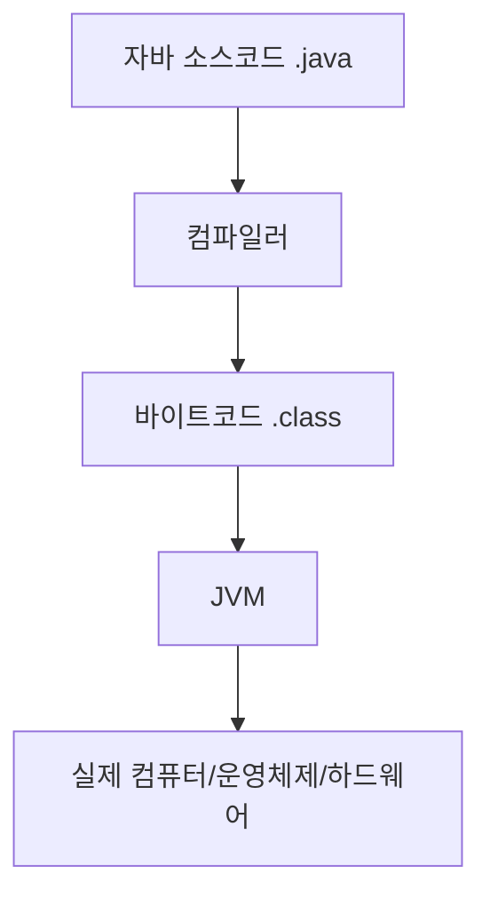

# chapter1. JVM이란 무엇인가?

## 1. JVM의 정의
JVM(Java Virtual Machine)은 자바 프로그램이 동작하는 가상의 컴퓨터입니다. 자바 코드를 컴퓨터가 이해할 수 있는 형태로 바꿔주고, 프로그램이 안전하게 실행되도록 도와줍니다.

- **쉽게 말해:**
  - 자바 코드를 "바이트코드"라는 중간 언어로 바꾼 뒤, JVM이 이 바이트코드를 읽어서 실행합니다.
  - 실제 컴퓨터(운영체제, CPU 등)와 자바 프로그램 사이에서 중간 역할을 합니다.

---

## 2. 왜 JVM이 필요할까?
- 자바 프로그램이 **운영체제(Windows, macOS, Linux 등)에 상관없이** 어디서나 똑같이 동작할 수 있게 해줍니다.
- 보안, 메모리 관리, 에러 감지 등도 JVM이 책임집니다.

---

## 3. JVM의 주요 역할
- 자바 바이트코드(.class 파일) 실행
- 메모리 관리(Heap, Stack 등)
- 예외 처리
- 가비지 컬렉션(GC)
- 보안 관리

---

## 4. Node.js/JS/TS와의 비교
- Node.js는 V8 엔진이 JS 코드를 바로 실행합니다.
- 자바는 JVM이 바이트코드를 실행합니다.
- JVM은 "Write Once, Run Anywhere"(한 번 작성, 어디서나 실행) 철학을 실현합니다.

---

## 5. mermaid 다이어그램: JVM의 위치

---

## 6. 실무 팁
- JVM 버전(예: Java 8, 11, 17 등)에 따라 지원 기능이 다르니, 프로젝트에 맞는 버전을 선택해야 합니다.
- Spring Boot 3.x는 Java 17 이상을 권장합니다.

---

## 7. 요약
- JVM은 자바 프로그램을 실행하는 가상 컴퓨터입니다.
- 운영체제에 상관없이 자바 프로그램을 실행할 수 있게 해줍니다.
- 메모리 관리, 보안, 에러 처리 등 다양한 역할을 합니다.
- 다음 챕터에서는 JVM의 메모리 구조에 대해 알아봅니다.

---

[다음 챕터: JVM의 메모리 구조 (Heap, Stack, Method Area 등)](./chapter2.%20JVM%EC%9D%98%20%EB%A9%94%EB%AA%A8%EB%A6%AC%20%EA%B5%AC%EC%A1%B0%20Heap-Stack-MethodArea.md)
