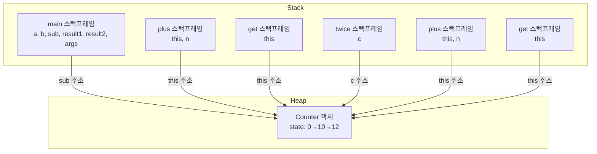

# chapter2. JVM의 메모리 구조 (Heap, Stack, Method Area 등)

## 1. JVM 메모리 구조란?
JVM은 자바 프로그램을 실행할 때 여러 종류의 메모리 영역을 사용합니다. 각 영역은 역할이 다르며, 효율적이고 안전한 실행을 위해 분리되어 있습니다.

---

## 2. Stack 영역 (스택)
- **정의:** 메소드 내에서 정의하는 기본 자료형(primitive type, 예: int, double, boolean 등)에 해당하는 지역변수와 매개변수의 데이터 값이 저장되는 공간입니다.
- **동작 원리:**
  - 메소드가 호출될 때마다 스택 영역에 "스택 프레임(Stack Frame)"이 생성됩니다.
  - 각 스택 프레임에는 해당 메소드의 매개변수, 지역변수, 리턴값 등이 저장됩니다.
  - 메소드 실행이 끝나면 해당 스택 프레임은 스택에서 제거됩니다.
- **특징:**
  - 후입선출(LIFO, Last-In-First-Out) 구조입니다.
  - 스코프(Scope)를 벗어나면 자동으로 메모리에서 사라집니다.
  - 각 스레드마다 독립적으로 생성됩니다.
- **스택 프레임:**
  - 하나의 메서드에 필요한 메모리 덩어리를 묶어서 스택 프레임이라고 하며, 메서드 호출 시 생성되고 종료 시 제거됩니다.

### Stack 동작 흐름 예시
```java
public class Counter {
    int state = 0;
    public void plus(int n) { state += n; }
    public int get() { return state; }
}

public class Main {
    public static void main(String[] args) {
        int a = 10;
        int b = 20;
        Counter sub = new Counter();
        sub.plus(a);
        int result1 = sub.get();
        twice(sub);
        int result2 = sub.get();
    }
    public static void twice(Counter c) {
        c.plus(2);
    }
}
```

#### 실행 흐름 상세 설명
1. **main() 스택 프레임 생성**
   - 지역변수 a, b, sub, result1, result2, 매개변수 args가 main() 스택 프레임에 저장됨
2. **new Counter()**
   - Heap에 Counter 객체 생성, sub는 Heap 객체의 주소값을 가짐
3. **sub.plus(a) 호출**
   - plus() 스택 프레임 생성, this(Heap의 Counter 객체), n(10) 저장
   - state += n 실행, Heap의 Counter 객체의 state가 10으로 변경
   - plus() 스택 프레임 제거
4. **sub.get() 호출**
   - get() 스택 프레임 생성, this(Heap의 Counter 객체) 저장
   - state 반환, get() 스택 프레임 제거, result1에 10 저장
5. **twice(sub) 호출**
   - twice() 스택 프레임 생성, c(Heap의 Counter 객체) 저장
   - c.plus(2) 호출 → plus() 스택 프레임 생성, this(Heap의 Counter 객체), n(2) 저장
   - state += n 실행, Heap의 Counter 객체의 state가 12로 변경
   - plus() 스택 프레임 제거, twice() 스택 프레임 제거
6. **sub.get() 호출**
   - get() 스택 프레임 생성, this(Heap의 Counter 객체) 저장
   - state 반환, get() 스택 프레임 제거, result2에 12 저장
7. **main() 종료**
   - main() 스택 프레임 제거, Heap의 Counter 객체는 참조가 없으면 GC 대상

---

### Stack & Heap 메모리 흐름 mermaid 도식화


---

## 3. Heap 영역 (힙)
- **정의:** JVM이 관리하는 프로그램 상에서 데이터를 저장하기 위해 런타임 시 동적으로 할당하여 사용하는 영역입니다.
- **저장 대상:**
  - 참조형(Reference Type) 데이터 타입을 갖는 객체(인스턴스), 배열 등이 저장됩니다.
  - 단, Heap 영역에 있는 객체를 가리키는 레퍼런스 변수는 Stack에 저장됩니다.
- **특징:**
  - Heap은 모든 스레드가 공유합니다.
  - Stack과 달리, 메소드가 종료되어도 Heap에 저장된 객체는 사라지지 않습니다.
  - 어떤 참조 변수도 Heap의 객체를 참조하지 않게 되면, GC(가비지 컬렉터)가 메모리를 청소합니다.
  - Stack은 스레드마다 생성되지만, Heap은 JVM 내에 단 하나만 존재합니다.
- **예시:**
  - `new Counter()`를 호출하면 Heap에 Counter 객체가 생성되고, Stack의 지역변수(sub)가 그 주소값을 저장합니다.

---

## 4. Method Area(메서드 영역, 또는 Metaspace)
- **정의:** 클래스 정보, static 변수, 상수 등이 저장되는 공간입니다.
- **특징:**
  - Java 8 이전: PermGen, Java 8 이후: Metaspace로 변경
  - JVM 전체에서 공유
- **실무:** 클래스 로딩, static 변수 관리와 관련된 이슈가 발생할 수 있습니다.

---

## 5. PC Register(프로그램 카운터 레지스터)
- **정의:** 현재 실행 중인 JVM 명령의 주소를 저장합니다.
- **특징:** 각 스레드마다 별도로 존재합니다.

---

## 6. Native Method Stack(네이티브 메서드 스택)
- **정의:** 자바가 아닌 네이티브 코드(C/C++ 등) 실행 시 사용되는 스택입니다.
- **특징:** 각 스레드마다 별도로 존재합니다.

---

## 7. Node.js/JS/TS와의 비교
- Node.js/JS/TS도 Heap과 Stack을 사용하지만, JVM처럼 명확하게 영역이 분리되어 있지 않습니다.
- 자바는 JVM이 메모리 관리를 자동으로 해주지만, JS/TS는 엔진(V8 등)이 내부적으로 관리합니다.

---

## 8. 실무 팁
- Heap 크기는 JVM 옵션(-Xmx, -Xms 등)으로 조절할 수 있습니다.
- Stack 크기도 -Xss 옵션으로 조절 가능합니다.
- 메모리 이슈 발생 시, Heap Dump, VisualVM, JProfiler 등 도구를 활용해 분석합니다.

---

## 9. 요약
- JVM은 Stack, Heap, Method Area, PC Register, Native Method Stack 등 다양한 메모리 영역을 사용합니다.
- 각 영역의 역할과 특징, 그리고 동작 원리를 이해하면, 메모리 이슈를 빠르게 진단할 수 있습니다.
- Heap과 Stack의 차이와 객체 참조, GC 동작을 명확히 이해하는 것이 중요합니다.

---

[다음 챕터: JVM의 동작 원리와 실행 과정](https://github.com/JadenMeister/Java_Kotlin_Document_for_beginner/blob/master/templates/Java/Jvm/chapters/chapter3.%20JVM%EC%9D%98%20%EB%8F%99%EC%9E%91%20%EC%9B%90%EB%A6%AC%EC%99%80%20%EC%8B%A4%ED%96%89%20%EA%B3%BC%EC%A0%95.md)
