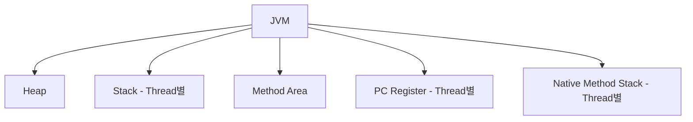

# chapter2. JVM의 메모리 구조 (Heap, Stack, Method Area 등)

## 1. JVM 메모리 구조란?
JVM은 자바 프로그램을 실행할 때 여러 종류의 메모리 영역을 사용합니다. 각 영역은 역할이 다르며, 효율적이고 안전한 실행을 위해 분리되어 있습니다.

---

## 2. 주요 메모리 영역

### 2-1. Heap(힙)
- **설명:** 객체와 배열이 저장되는 공간입니다.
- **특징:**
  - 모든 스레드가 공유합니다.
  - 가비지 컬렉터(GC)가 관리합니다.
- **실무:** 메모리 누수, OutOfMemoryError 등 대부분의 메모리 이슈가 Heap에서 발생합니다.

### 2-2. Stack(스택)
- **설명:** 메서드 호출 시 지역 변수, 매개변수, 리턴 주소 등이 저장됩니다.
- **특징:**
  - 각 스레드마다 별도의 Stack이 할당됩니다.
  - 메서드 실행이 끝나면 자동으로 메모리가 해제됩니다.
- **실무:** StackOverflowError(재귀 호출 등) 발생 위치입니다.

### 2-3. Method Area(메서드 영역, 또는 Metaspace)
- **설명:** 클래스 정보, static 변수, 상수 등이 저장됩니다.
- **특징:**
  - Java 8 이전: PermGen, Java 8 이후: Metaspace로 변경
  - JVM 전체에서 공유
- **실무:** 클래스 로딩, static 변수 관리와 관련된 이슈가 발생할 수 있습니다.

### 2-4. PC Register(프로그램 카운터 레지스터)
- **설명:** 현재 실행 중인 JVM 명령의 주소를 저장합니다.
- **특징:**
  - 각 스레드마다 별도로 존재

### 2-5. Native Method Stack(네이티브 메서드 스택)
- **설명:** 자바가 아닌 네이티브 코드(C/C++ 등) 실행 시 사용되는 스택
- **특징:**
  - 각 스레드마다 별도로 존재

---

## 3. mermaid 다이어그램: JVM 메모리 구조

---

## 4. Node.js/JS/TS와의 비교
- Node.js/JS/TS도 Heap과 Stack을 사용하지만, JVM처럼 명확하게 영역이 분리되어 있지 않습니다.
- 자바는 JVM이 메모리 관리를 자동으로 해주지만, JS/TS는 엔진(V8 등)이 내부적으로 관리합니다.

---

## 5. 실무 팁
- Heap 크기는 JVM 옵션(-Xmx, -Xms 등)으로 조절할 수 있습니다.
- Stack 크기도 -Xss 옵션으로 조절 가능합니다.
- 메모리 이슈 발생 시, Heap Dump, VisualVM, JProfiler 등 도구를 활용해 분석합니다.

---

## 6. 요약
- JVM은 Heap, Stack, Method Area, PC Register, Native Method Stack 등 다양한 메모리 영역을 사용합니다.
- 각 영역의 역할과 특징을 이해하면, 메모리 이슈를 빠르게 진단할 수 있습니다.

---

[다음 챕터: JVM의 동작 원리와 실행 과정](./chapter3.%20JVM%EC%9D%98%20%EB%8F%99%EC%9E%91%20%EC%9B%90%EB%A6%AC%EC%99%80%20%EC%8B%A4%ED%96%89%20%EA%B3%BC%EC%A0%95.md)
