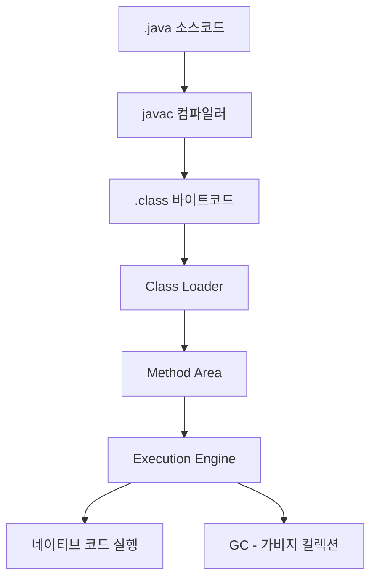

# chapter3. JVM의 동작 원리와 실행 과정

## 1. JVM의 동작 흐름 개요
JVM은 자바 소스코드를 컴파일하고, 바이트코드로 변환한 뒤, 이를 실행하는 일련의 과정을 거칩니다. 이 과정은 자바가 플랫폼 독립적으로 동작할 수 있게 해주는 핵심입니다.

---

## 2. 실행 과정 단계별 설명

### 2-1. 자바 소스코드 작성 및 컴파일
- 개발자가 .java 파일에 코드를 작성합니다.
- 자바 컴파일러(javac)가 .java 파일을 .class(바이트코드) 파일로 변환합니다.

### 2-2. 클래스 로딩
- JVM의 Class Loader가 .class 파일을 메모리(Method Area)에 로드합니다.
- 로딩된 클래스는 실행 준비가 됩니다.

### 2-3. 바이트코드 실행
- JVM의 Execution Engine이 바이트코드를 한 줄씩 해석(인터프리터)하거나, JIT(Just-In-Time) 컴파일러가 네이티브 코드로 변환해 실행합니다.
- JIT 컴파일은 자주 실행되는 코드를 빠르게 실행할 수 있도록 최적화합니다.

### 2-4. 메모리 관리 및 GC
- 실행 중 객체는 Heap에 저장되고, 사용이 끝난 객체는 GC(Garbage Collector)가 자동으로 정리합니다.

---

## 3. mermaid 다이어그램: JVM 실행 흐름

---

## 4. Node.js/JS/TS와의 비교
- Node.js/JS/TS는 소스코드를 바로 실행하거나, JIT 컴파일을 통해 네이티브 코드로 변환합니다.
- 자바는 명확한 컴파일 단계와 클래스 로딩, 바이트코드 실행, GC 등 JVM만의 구조적 특징이 있습니다.

---

## 5. 실무 팁
- JVM 옵션(-XX:+UseG1GC 등)으로 GC 방식, JIT 동작 등을 조절할 수 있습니다.
- 실행 성능 이슈가 있을 때, JIT 컴파일 로그, GC 로그 등을 분석해 원인을 찾습니다.

---

## 6. 요약
- JVM은 소스코드 → 바이트코드 → 클래스 로딩 → 실행 → GC의 과정을 거칩니다.
- 각 단계의 역할을 이해하면, 성능 최적화와 문제 해결에 도움이 됩니다.

---

[다음 챕터: GC(Garbage Collection)와 메모리 관리](./chapter4.%20GC-GarbageCollection-%EB%A9%94%EB%AA%A8%EB%A6%AC%EA%B4%80%EB%A6%AC.md)
