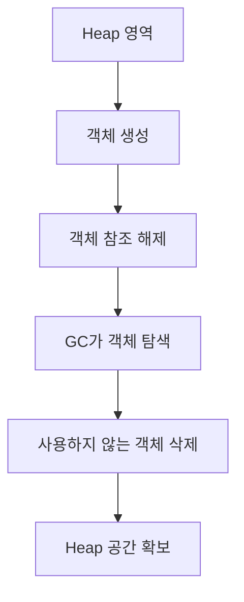

# chapter4. GC(Garbage Collection)와 메모리 관리

## 1. GC(Garbage Collection)란?
GC는 JVM이 사용하지 않는 객체(더 이상 참조되지 않는 객체)를 자동으로 메모리에서 정리(삭제)해주는 기능입니다. 개발자가 직접 메모리를 해제하지 않아도 되므로, 메모리 누수와 같은 문제를 줄일 수 있습니다.

---

## 2. GC의 동작 원리
- **Mark & Sweep:** 더 이상 사용하지 않는 객체를 표시(Mark)하고, 메모리에서 제거(Sweep)합니다.
- **Generational GC:** 객체의 생존 기간에 따라 Young, Old(또는 Tenured) 영역으로 나누어 관리합니다.
- **Stop-the-world:** GC가 동작하는 동안 모든 애플리케이션 스레드가 일시 중지됩니다.

---

## 3. GC의 종류 (Java 17 기준)
- **Serial GC:** 단일 스레드로 동작, 작은 애플리케이션에 적합
- **Parallel GC:** 여러 스레드로 동작, Throughput(처리량) 중시
- **G1 GC:** 대규모 서비스에 적합, 예측 가능한 짧은 일시정지 시간
- **ZGC, Shenandoah:** 매우 짧은 일시정지 시간, 최신 JVM에서 지원

---

## 4. 메모리 관리 실무 팁
- JVM 옵션(-Xms, -Xmx, -XX:+UseG1GC 등)으로 Heap 크기와 GC 방식을 조절할 수 있습니다.
- Heap Dump, VisualVM, JProfiler 등 도구로 메모리 사용 현황을 분석합니다.
- OutOfMemoryError, GC Overhead Limit Exceeded 등 에러 발생 시, GC 로그를 분석해 원인을 파악합니다.

---

## 5. mermaid 다이어그램: GC 동작 개념

---

## 6. Node.js/JS/TS와의 비교
- Node.js(V8 엔진)도 GC를 지원하지만, JVM만큼 다양한 GC 정책을 선택할 수는 없습니다.
- 자바는 GC 옵션, Heap 크기 등 세밀한 튜닝이 가능합니다.

---

## 7. 요약
- GC는 JVM이 메모리를 자동으로 관리하는 핵심 기능입니다.
- 다양한 GC 정책과 튜닝 방법을 이해하면, 메모리 이슈를 효과적으로 해결할 수 있습니다.

---

[다음 챕터: JVM 튜닝과 실무 활용 팁](./chapter5.%20JVM%20%ED%8A%9C%EB%8B%9D%EA%B3%BC%20%EC%8B%A4%EB%AC%B4%20%ED%99%9C%EC%9A%A9%20%ED%8C%81.md)

