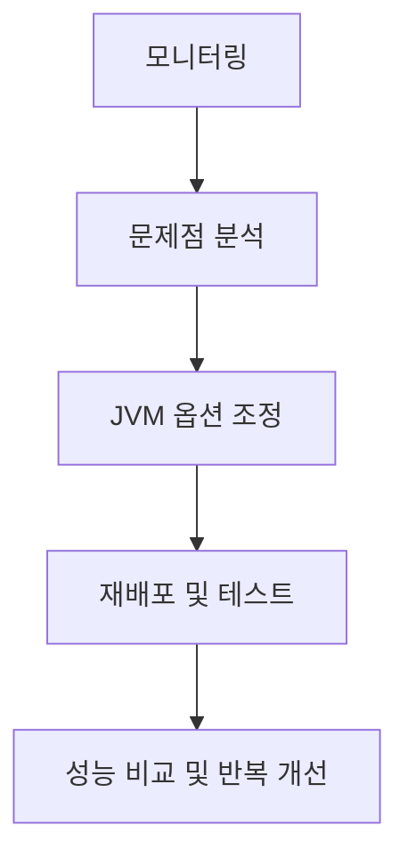

# chapter5. JVM 튜닝과 실무 활용 팁

## 1. JVM 튜닝이란?
JVM 튜닝은 애플리케이션의 성능, 안정성, 효율성을 높이기 위해 JVM의 다양한 설정(옵션, 메모리, GC, JIT 등)을 조정하는 작업입니다.

---

## 2. 주요 튜닝 포인트

### 2-1. 메모리 옵션
- **-Xms, -Xmx:** Heap의 초기/최대 크기 설정
- **-Xss:** 각 스레드의 Stack 크기 설정
- **-XX:MetaspaceSize, -XX:MaxMetaspaceSize:** 메서드 영역(Metaspace) 크기 설정

### 2-2. GC 옵션
- **-XX:+UseG1GC, -XX:+UseParallelGC, -XX:+UseZGC 등:** GC 알고리즘 선택
- **-XX:MaxGCPauseMillis:** GC 일시정지 시간 목표 설정
- **-XX:+PrintGCDetails, -Xlog:gc:** GC 로그 출력

### 2-3. JIT(Just-In-Time) 컴파일러 옵션
- **-XX:CompileThreshold:** JIT 컴파일러가 동작하는 임계값 조정
- **-XX:+PrintCompilation:** JIT 컴파일 로그 출력

---

## 3. 실무에서의 튜닝 절차
1. GC/메모리/CPU 등 모니터링 도구로 현황 파악
2. 병목 구간, GC 일시정지, OutOfMemory 등 문제점 분석
3. JVM 옵션 조정 및 재배포
4. 튜닝 전후 성능 비교 및 반복 개선

---

## 4. mermaid 다이어그램: JVM 튜닝 흐름

---

## 5. Node.js/JS/TS와의 비교
- Node.js/JS/TS는 런타임 옵션이 제한적이며, JVM만큼 세밀한 튜닝이 어렵습니다.
- 자바는 GC, 메모리, JIT 등 다양한 옵션을 통해 대규모 서비스에 맞는 최적화가 가능합니다.

---

## 6. 실무 팁
- 튜닝은 무조건 성능 향상을 보장하지 않으므로, 충분한 모니터링과 테스트가 필수입니다.
- JVM 공식 문서, GC 튜닝 가이드, 실무 사례 등을 참고해 신중하게 적용하세요.

---

## 7. 요약
- JVM 튜닝은 성능, 안정성, 효율성 향상을 위한 필수 작업입니다.
- 다양한 옵션과 도구를 활용해, 서비스 환경에 맞는 최적의 JVM 설정을 찾으세요.

---

[이전 챕터: GC(Garbage Collection)와 메모리 관리](./chapter4.%20GC-GarbageCollection-%EB%A9%94%EB%AA%A8%EB%A6%AC%EA%B4%80%EB%A6%AC.md)

