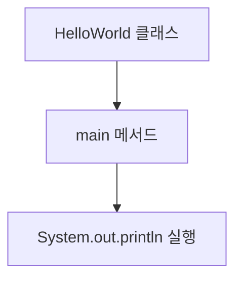

chapter1. 자바의 기본 구조 이해하기

자바 프로그램은 클래스 단위로 작성되며, main 메서드가 프로그램의 시작점입니다.

```java
public class HelloWorld { // 클래스 선언, 파일명과 동일해야 함
    public static void main(String[] args) { // main 메서드: 프로그램 시작점
        System.out.println("Hello, World!"); // 콘솔에 문자열 출력
    }
}
```



