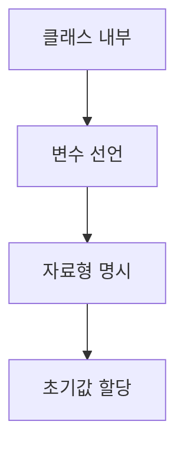

chapter2. 변수와 자료형 - 자바와 JS/TS 비교

---

# 개요

이 챕터에서는 자바의 변수 선언과 자료형을 Node.js, JavaScript, TypeScript와 비교하여 설명합니다. 초보자가 헷갈릴 수 있는 타입 시스템, 변수 선언 방식, 파일 위치, 실무에서의 활용법을 상세히 다룹니다.

---

## 1. 변수 선언 방식 비교

| 언어 | 변수 선언 키워드 | 예시 |
|------|------------------|------|
| Java | int, double, String 등 | int age = 25; |
| JavaScript | var, let, const | let age = 25; |
| TypeScript | let, const (타입 명시) | let age: number = 25; |

---

## 2. 자바 변수 선언 예시

```java
int age = 25; // 정수형 변수 선언 및 초기화
String name = "홍길동"; // 문자열 변수 선언 및 초기화
boolean isActive = true; // 논리형 변수 선언 및 초기화
```

- `int`, `String`, `boolean` 등은 자바의 기본 자료형입니다.
- 변수 선언 시 타입을 반드시 명시해야 하며, 타입이 다르면 컴파일 에러가 발생합니다.

---

## 3. JavaScript/TypeScript 변수 선언 예시

### JavaScript
```javascript
let age = 25; // 타입을 명시하지 않아도 됨 (동적 타입)
let name = "홍길동";
let isActive = true;
```

### TypeScript
```typescript
let age: number = 25; // 타입을 명시 (정적 타입)
let name: string = "홍길동";
let isActive: boolean = true;
```

- JavaScript는 동적 타입, TypeScript는 정적 타입(자바와 유사)

---

## 4. 자바의 자료형 종류

- 기본형: int, double, boolean, char 등
- 참조형: String, 배열, 클래스 등

```java
int score = 90; // 정수형
double average = 85.5; // 실수형
char grade = 'A'; // 문자형
String comment = "Good job!"; // 문자열
```

---

## 5. 변수와 자료형의 파일 위치 및 패턴

- 자바 변수 선언은 클래스 내부에서 이루어집니다.
- 예시 파일 위치: `/src/main/java/com/example/demo/chapters/VariableExample.java`
- 본 문서 예제는 `/templates/Java/chapters/chapter2. 변수와 자료형 - 자바와 JS/TS 비교.md`에 위치
- 이유: 챕터별로 주제를 분리하여 학습 흐름을 명확히 함

---

## 6. 실무에서 변수와 자료형 활용 팁

- 자바는 타입이 엄격하므로, 변수 선언 시 타입을 반드시 확인
- TypeScript를 병행 학습하면 타입 시스템 이해에 도움이 됨
- 변수명은 의미 있게 작성, camelCase 권장

---

## 7. mermaid로 변수 선언 흐름 시각화



---

## 8. 참고

- 자바 공식 문서: https://docs.oracle.com/en/java/
- TypeScript 공식 문서: https://www.typescriptlang.org/docs/

---

## 9. 다음 챕터 예고

- 함수 선언과 메서드: 실무 활용 중심

