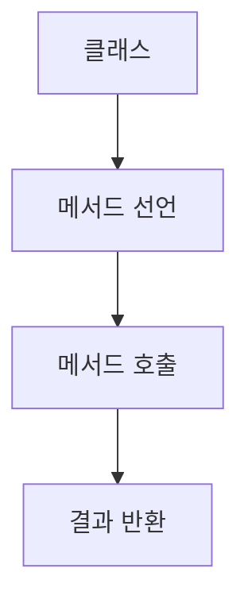

chapter3. 함수 선언과 메서드 - 실무 활용 중심

---

# 개요

이 챕터에서는 자바의 함수(메서드) 선언과 활용법을 Node.js, JavaScript, TypeScript와 비교하여 설명합니다. 초보자가 실무에서 자주 사용하는 패턴, 함수 구조, 파일 위치, 한 줄 한 줄 주석, 실무 팁을 상세히 다룹니다.

---

## 1. 함수 선언 방식 비교

| 언어 | 함수 선언 키워드 | 예시 |
|------|------------------|------|
| Java | 반환타입, 메서드명 | public int add(int a, int b) {...} |
| JavaScript | function | function add(a, b) {...} |
| TypeScript | function (타입 명시) | function add(a: number, b: number): number {...} |

---

## 2. 자바 함수(메서드) 선언 예시

```java
public int add(int a, int b) { // public: 접근제어자, int: 반환타입, add: 메서드명
    return a + b; // 두 정수의 합을 반환
}
```

- 자바는 반드시 반환타입과 매개변수 타입을 명시해야 함
- 메서드는 클래스 내부에 선언

---

## 3. JavaScript/TypeScript 함수 선언 예시

### JavaScript
```javascript
function add(a, b) { // 함수 선언, 타입 미지정
    return a + b;
}
```

### TypeScript
```typescript
function add(a: number, b: number): number { // 타입 명시
    return a + b;
}
```

---

## 4. 자바 메서드의 파일 위치 및 패턴

- 자바 메서드는 클래스 내부에 위치
- 예시 파일 위치: `/src/main/java/com/example/demo/chapters/FunctionExample.java`
- 본 문서 예제는 `/templates/Java/chapters/chapter3. 함수 선언과 메서드 - 실무 활용 중심.md`에 위치
- 이유: 챕터별로 주제를 분리하여 학습 흐름을 명확히 함

---

## 5. 실무에서 함수/메서드 활용 팁

- 메서드명은 동사+명사 형태로 작성, camelCase 권장
- 매개변수와 반환타입을 명확히 지정
- 재사용성을 높이기 위해 기능별로 메서드 분리

---

## 6. mermaid로 함수 호출 흐름 시각화



---

## 7. 참고

- 자바 공식 문서: https://docs.oracle.com/en/java/
- TypeScript 공식 문서: https://www.typescriptlang.org/docs/

---

## 8. 다음 챕터 예고

- 클래스와 객체지향: MVC 패턴의 이해

