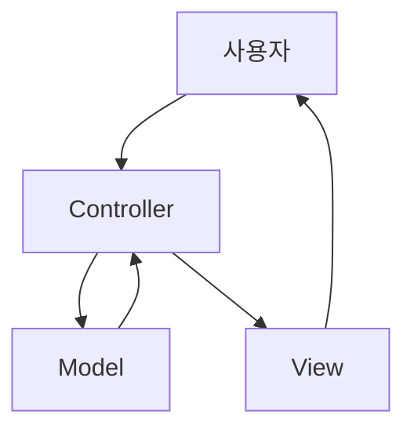

chapter4. 클래스와 객체지향 - MVC 패턴의 이해

---

# 개요

이 챕터에서는 자바의 클래스와 객체지향 개념을 Node.js, JavaScript, TypeScript와 비교하며, MVC 패턴의 기본 구조와 실무 적용 방법을 초보자 관점에서 설명합니다.

---

## 1. 클래스 선언 방식 비교

| 언어 | 클래스 선언 키워드 | 예시 |
|------|------------------|------|
| Java | class | public class User {...} |
| JavaScript | class | class User {...} |
| TypeScript | class (타입 명시) | class User {...} |

---

## 2. 자바 클래스 선언 예시

```java
public class User { // 클래스 선언, public: 접근제어자
    private String name; // 필드 선언, private: 외부 접근 불가
    private int age;

    public User(String name, int age) { // 생성자
        this.name = name;
        this.age = age;
    }

    public String getName() { // getter 메서드
        return name;
    }

    public int getAge() { // getter 메서드
        return age;
    }
}
```

- 클래스는 객체의 설계도 역할
- 필드, 생성자, 메서드로 구성
- 접근제어자(public, private 등)로 외부 접근 제어

---

## 3. JavaScript/TypeScript 클래스 선언 예시

### JavaScript
```javascript
class User {
    constructor(name, age) {
        this.name = name;
        this.age = age;
    }
    getName() {
        return this.name;
    }
    getAge() {
        return this.age;
    }
}
```

### TypeScript
```typescript
class User {
    name: string;
    age: number;
    constructor(name: string, age: number) {
        this.name = name;
        this.age = age;
    }
    getName(): string {
        return this.name;
    }
    getAge(): number {
        return this.age;
    }
}
```

---

## 4. MVC 패턴의 기본 구조

- Model: 데이터와 비즈니스 로직 담당 (예: User 클래스)
- View: 사용자 인터페이스 담당 (자바에서는 JSP, JS/TS에서는 React 등)
- Controller: 사용자 요청 처리 및 Model-View 연결



---

## 5. 자바 MVC 패턴 예시 파일 위치 및 패턴

- Model: `/src/main/java/com/example/demo/model/User.java`
- Controller: `/src/main/java/com/example/demo/controller/UserController.java`
- View: `/src/main/resources/templates/user.html` (Spring Boot 기준)
- 본 문서 예제는 `/templates/Java/chapters/chapter4. 클래스와 객체지향 - MVC 패턴의 이해.md`에 위치
- 이유: 역할별로 파일을 분리하여 유지보수와 확장에 용이함

---

## 6. 실무에서 클래스/객체지향 활용 팁

- 필드와 메서드는 접근제어자를 명확히 지정
- 생성자와 getter/setter를 활용해 데이터 보호
- MVC 패턴을 적용하면 코드 구조가 명확해지고 협업에 유리

---

## 7. 참고

- 자바 공식 문서: https://docs.oracle.com/en/java/
- 스프링부트 MVC 공식 문서: https://docs.spring.io/spring-framework/reference/web/webmvc.html

---

## 8. 다음 챕터 예고

- 스프링부트와 자바의 실무 적용

