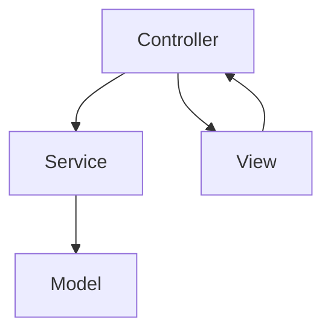

chapter5. 스프링부트와 자바의 실무 적용

---

# 개요

이 챕터에서는 최신 스프링부트(3.x)와 자바(JDK 17 이상)를 활용한 실무 프로젝트 구조, 주요 설정, REST API 예시, Node.js/Express와의 비교, 파일 위치, 한 줄 한 줄 주석, 실무 팁을 초보자 관점에서 상세히 다룹니다.

---

## 1. 프로젝트 구조 예시

```
/src/main/java/com/example/demo/
  controller/
    UserController.java
  service/
    UserService.java
  model/
    User.java
/src/main/resources/
  application.yml
  templates/
    user.html
```

- controller: HTTP 요청 처리
- service: 비즈니스 로직
- model: 데이터 구조
- resources: 설정 및 뷰 파일

---

## 2. 스프링부트 REST API 예시

```java
@RestController // REST API 컨트롤러임을 명시
@RequestMapping("/users") // 기본 URL 경로 지정
public class UserController {
    private final UserService userService; // 서비스 객체 주입

    public UserController(UserService userService) {
        this.userService = userService;
    }

    @GetMapping // GET 요청 처리
    public List<User> getAllUsers() {
        return userService.getAllUsers(); // 모든 사용자 반환
    }
}
```

- @RestController: REST API 컨트롤러 지정
- @RequestMapping: URL 경로 지정
- @GetMapping: GET 요청 처리
- 의존성 주입, 서비스 계층 분리

---

## 3. Node.js/Express와의 비교

| 항목 | Node.js/Express | Java/Spring Boot |
|------|-----------------|------------------|
| 라우팅 | app.get('/users') | @GetMapping |
| 서비스 분리 | 직접 함수 호출 | Service 계층 분리 |
| 설정 | .env, config.js | application.yml |
| 파일 구조 | /routes, /controllers | /controller, /service |

---

## 4. 주요 설정 파일 예시

### application.yml
```yaml
server:
  port: 8080
spring:
  datasource:
    url: jdbc:mysql://localhost:3306/demo
    username: root
    password: password
```

- 서버 포트, DB 연결 등 환경설정 관리

---

## 5. 실무에서 스프링부트 활용 팁

- 계층별로 파일을 분리하여 유지보수 용이
- 의존성 주입(DI)으로 테스트와 확장성 강화
- application.yml로 환경별 설정 관리
- 최신 버전(JDK 17+, Spring Boot 3.x) 사용 권장

---

## 6. mermaid로 프로젝트 구조 시각화



---

## 7. 참고

- 스프링부트 공식 문서: https://docs.spring.io/spring-boot/docs/current/reference/htmlsingle/
- 자바 공식 문서: https://docs.oracle.com/en/java/

---

## 8. 다음 챕터 예고

- 비동기 프로그래밍: JS/TS와 자바의 차이

