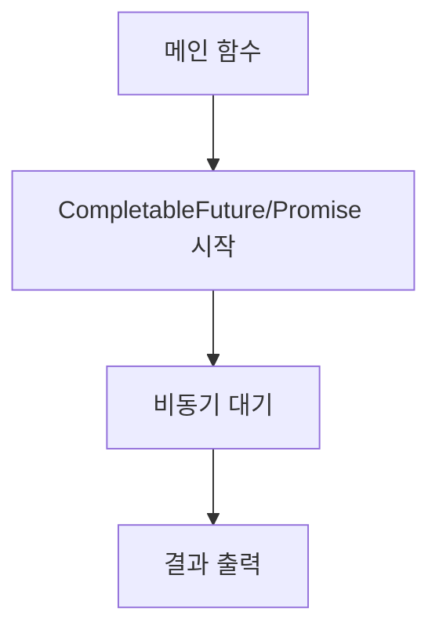

chapter6. 비동기 프로그래밍 - JS/TS와 자바의 차이

---

# 개요

이 챕터에서는 자바의 비동기 프로그래밍(CompletableFuture 등)을 Node.js/JavaScript/TypeScript의 Promise/async와 비교하여 설명합니다. 초보자가 실무에서 비동기 처리를 어떻게 구현하는지, 각 언어별 차이와 장단점, 예시 코드, 한 줄 한 줄 주석, mermaid 시각화, 파일 위치 설명을 포함합니다.

---

## 1. 비동기 처리 방식 비교

| 언어 | 비동기 처리 방식 | 예시 |
|------|------------------|------|
| Java | CompletableFuture | CompletableFuture.supplyAsync {...} |
| JavaScript | Promise/async | async function, await |
| TypeScript | Promise/async (타입 명시) | async function, await |

---

## 2. 자바 CompletableFuture 예시

```java
import java.util.concurrent.CompletableFuture;

public class AsyncExample {
    public static void main(String[] args) {
        CompletableFuture<Void> future = CompletableFuture.supplyAsync(() -> {
            try {
                Thread.sleep(1000); // 1초 대기 (비동기)
            } catch (InterruptedException e) {
                e.printStackTrace();
            }
            System.out.println("CompletableFuture 완료!"); // 결과 출력
            return null;
        });
        System.out.println("메인 함수 종료"); // 메인 함수 실행
        future.join(); // 비동기 작업 완료 대기
    }
}
```

- CompletableFuture: 비동기 작업을 처리하는 자바 클래스
- supplyAsync: 비동기 작업 시작
- Thread.sleep: 비동기 대기(스레드 블로킹)
- join: 비동기 작업 완료 대기

---

## 3. JavaScript/TypeScript 비동기 예시

### JavaScript
```javascript
async function runAsync() {
    await new Promise(resolve => setTimeout(resolve, 1000)); // 1초 대기
    console.log("Promise 완료!"); // 결과 출력
}
runAsync();
console.log("메인 함수 종료");
```

### TypeScript
```typescript
async function runAsync(): Promise<void> {
    await new Promise(resolve => setTimeout(resolve, 1000)); // 1초 대기
    console.log("Promise 완료!"); // 결과 출력
}
runAsync();
console.log("메인 함수 종료");
```

---

## 4. 파일 위치 및 패턴 설명

- 자바 비동기 코드는 일반적으로 서비스 계층 또는 별도 유틸 클래스에 위치
- 예시 파일 위치: `/src/main/java/com/example/demo/service/AsyncService.java`
- 본 문서 예제는 `/templates/Java/chapters/chapter6. 비동기 프로그래밍 - JS/TS와 자바의 차이.md`에 위치
- 이유: 비동기 로직을 분리하여 유지보수와 테스트에 용이함

---

## 5. 실무에서 비동기 프로그래밍 활용 팁

- CompletableFuture는 비동기 작업, 콜백, 예외 처리에 적합
- thenApply, thenAccept, exceptionally 등 다양한 메서드 활용
- JS/TS의 Promise/async와 개념적으로 유사
- WebFlux(reactive)도 실무에서 활용 가능

---

## 6. mermaid로 비동기 흐름 시각화



---

## 7. 참고

- 자바 CompletableFuture 공식 문서: https://docs.oracle.com/en/java/javase/17/docs/api/java.base/java/util/concurrent/CompletableFuture.html
- JavaScript Promise 공식 문서: https://developer.mozilla.org/ko/docs/Web/JavaScript/Reference/Global_Objects/Promise

---

## 8. 다음 챕터 예고

- 파일 구조와 패키지 관리

