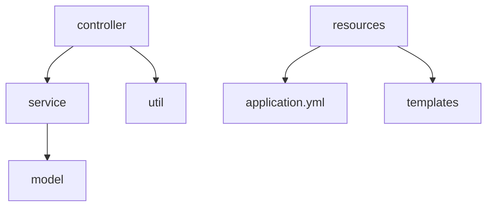

chapter7. 파일 구조와 패키지 관리

---

# 개요

이 챕터에서는 자바의 실무 프로젝트에서 많이 사용하는 파일 구조와 패키지 관리 방법을 초보자 관점에서 설명합니다. 각 디렉토리의 역할, 패키지 선언 방법, 실무 팁, 예시 코드, mermaid 시각화, 공식 문서 링크를 포함합니다.

---

## 1. 자바 프로젝트 파일 구조 예시

```
/src/main/java/com/example/demo/
  controller/
    UserController.java
  service/
    UserService.java
  model/
    User.java
  util/
    DateUtil.java
/src/main/resources/
  application.yml
  templates/
    user.html
```

- controller: HTTP 요청 처리
- service: 비즈니스 로직
- model: 데이터 구조
- util: 공통 유틸리티 클래스
- resources: 설정 및 뷰 파일

---

## 2. 패키지 선언 및 관리 방법

```java
package com.example.demo.controller; // controller 패키지 선언

public class UserController {
    // ...코드 생략...
}
```

- package 키워드로 파일 상단에 패키지 선언
- 디렉토리 구조와 패키지명이 일치해야 함
- 역할별로 패키지를 분리하면 유지보수와 협업에 유리

---

## 3. 실무에서 파일 구조/패키지 관리 팁

- 역할별로 controller, service, model, util 등 패키지 분리
- 패키지명은 회사/프로젝트 도메인 기준으로 작성(com.example.demo 등)
- 공통 유틸리티는 util 패키지에 관리
- resources 디렉토리에는 환경설정(application.yml)과 뷰 파일(templates) 관리

---

## 4. mermaid로 파일 구조 시각화



---

## 5. 참고

- 자바 공식 문서: https://docs.oracle.com/en/java/
- 스프링부트 공식 문서: https://docs.spring.io/spring-boot/docs/current/reference/htmlsingle/

---

## 6. 마무리 및 실전 적용 팁

- 파일 구조와 패키지 관리는 프로젝트의 유지보수성과 확장성을 결정
- 역할별로 명확하게 분리하고, 표준 구조를 따르는 것이 실무에서 중요

