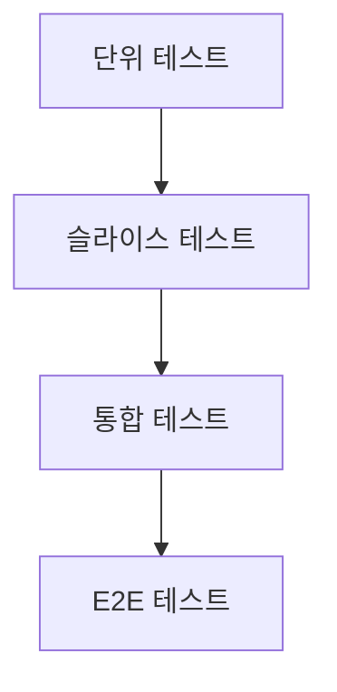

# chapter1. 자바 테스트의 기본 개념과 종류 (단위/통합/슬라이스)

## 개요
이 챕터에서는 자바에서의 테스트의 기본 개념과 종류(단위 테스트, 통합 테스트, 슬라이스 테스트)에 대해 다룹니다. Node.js/Express, JavaScript/TypeScript와의 비교도 함께 설명합니다.

---

## 1. 테스트란?
- **테스트(Test)**란 소프트웨어가 의도한 대로 동작하는지 검증하는 과정입니다.
- 자바에서는 주로 JUnit, Spring Boot Test 등 프레임워크를 사용합니다.
- Node.js/Express에서는 Jest, Mocha, Supertest 등이 많이 사용됩니다.

---

## 2. 테스트의 종류

### 2.1 단위 테스트(Unit Test)
- **정의:** 가장 작은 단위(메서드, 함수 등)를 독립적으로 검증
- **예시:**
  - 자바: JUnit의 @Test 사용
  - JS/TS: Jest의 `test()` 또는 `it()` 사용
- **장점:** 빠르고, 버그를 조기에 발견 가능
- **단점:** 통합된 환경에서의 문제는 잡기 어려움

### 2.2 통합 테스트(Integration Test)
- **정의:** 여러 컴포넌트(모듈, 클래스 등)가 함께 동작하는지 검증
- **예시:**
  - 자바: SpringBootTest, @SpringBootTest 어노테이션
  - JS/TS: Supertest로 API 통합 테스트
- **장점:** 실제 환경과 유사하게 검증 가능
- **단점:** 느리고, 디버깅이 어려울 수 있음

### 2.3 슬라이스 테스트(Slice Test)
- **정의:** 특정 계층(예: Controller, Service, Repository)만 분리해서 검증
- **예시:**
  - 자바: @WebMvcTest, @DataJpaTest 등
  - JS/TS: 계층별 mocking 활용
- **장점:** 빠르고, 계층별 문제를 쉽게 파악
- **단점:** 전체 플로우는 검증하지 못함

---

## 3. 테스트 계층 구조 (Mermaid)

---

## 4. 실무에서의 적용
- **자바(Spring Boot):**
  - 단위 테스트: JUnit, Mockito
  - 통합 테스트: @SpringBootTest
  - 슬라이스 테스트: @WebMvcTest, @DataJpaTest
- **Node.js/Express:**
  - 단위 테스트: Jest, Mocha
  - 통합 테스트: Supertest
  - 슬라이스 테스트: 계층별 mocking

---

## 5. 결론
- 테스트는 소프트웨어 품질을 높이는 필수 과정
- 각 테스트의 목적과 장단점을 이해하고, 상황에 맞게 선택하는 것이 중요

---

> **Tip:**
> - 자바의 테스트 코드는 일반적으로 `src/test/java` 디렉토리에 위치합니다. 이는 표준 Maven/Gradle 프로젝트 구조를 따르며, 테스트와 실제 코드를 분리하여 관리하기 위함입니다.
> - Node.js/Express에서는 `__tests__` 폴더나 `test` 폴더를 별도로 두는 것이 일반적입니다.
