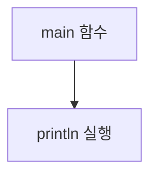

chapter1. 코틀린의 기본 구조 이해하기

---

# 개요

이 문서는 Node.js, Express, JavaScript, TypeScript 경험이 있는 신입 웹 개발자가 코틀린의 기본 구조를 이해할 수 있도록 작성되었습니다. 스프링부트와 MVC 패턴, 그리고 자바와 코틀린의 차이점, 최신 버전 기준의 정보, 파일 위치와 패턴, 그리고 각 코드의 한 줄 한 줄 설명을 제공합니다.

---

## 1. 코틀린의 기본 구조란?

- 코틀린은 JVM 기반의 언어로, 함수형 프로그래밍과 객체지향 프로그래밍을 모두 지원합니다.
- Node.js/Express와 달리, 코틀린은 main 함수에서 프로그램이 시작됩니다.
- 자바스크립트/타입스크립트의 `function main() {}`와 유사하지만, 타입 시스템과 실행 환경이 다릅니다.

---

## 2. 파일 위치 및 패턴 설명

- 코틀린 소스 파일은 일반적으로 `/src/main/kotlin/패키지명/`에 위치합니다.
- 본 문서 예제는 학습용이므로 `/templates/Kotlin/chapters/`에 위치합니다.
- 이유: 각 언어별 챕터를 독립적으로 관리하여, 학습 흐름과 유지보수에 용이함.

---

## 3. Hello World 예제 비교

### 코틀린
```kotlin
fun main() { // main 함수: 프로그램 시작점
    println("Hello, World!") // 콘솔에 문자열 출력
}
```

### 자바스크립트
```javascript
function main() { // main 함수: 프로그램 시작점
    console.log("Hello, World!"); // 콘솔에 문자열 출력
}
main(); // main 함수 호출
```

### 타입스크립트
```typescript
function main(): void { // main 함수: 반환 타입 명시
    console.log("Hello, World!"); // 콘솔에 문자열 출력
}
main(); // main 함수 호출
```

---

## 4. 한 줄 한 줄 설명 (코틀린)

```kotlin
fun main() { // main 함수 선언, 프로그램의 진입점
    println("Hello, World!") // 표준 출력에 문자열을 출력
}
```
- `fun main()`: 코틀린에서 함수는 `fun` 키워드로 선언합니다. main 함수는 프로그램의 시작점입니다.
- `println(...)`: 콘솔에 값을 출력하는 함수입니다. 자바스크립트의 `console.log`와 유사합니다.

---

## 5. mermaid로 구조 시각화



---

## 6. 최신 버전 정보 및 호환성

- 2025년 기준 코틀린 최신 버전은 2.x입니다. JVM 17 이상과 호환됩니다.
- 만약 스프링부트와 연동 시, 스프링부트 3.x와 코틀린 2.x 조합이 가장 안정적입니다.
- 구버전 JVM(예: 8, 11)에서는 일부 코틀린 최신 문법이 동작하지 않을 수 있으니, 환경을 반드시 확인하세요.

---

## 7. 추가 비교: Node.js/Express와 코틀린

| 항목 | Node.js/Express | 코틀린 |
|------|-----------------|--------|
| 진입점 | app.listen() | main 함수 |
| 비동기 처리 | Promise/async | 코루틴(launch, async 등) |
| 타입 | 동적(자바스크립트) | 정적(코틀린) |
| 파일 위치 | /src, /routes 등 | /src/main/kotlin/패키지명 |

---

## 8. 참고 및 학습 팁

- 코틀린 공식 문서: https://kotlinlang.org/docs/home.html
- 스프링부트 공식 문서: https://docs.spring.io/spring-boot/docs/current/reference/htmlsingle/
- 자바스크립트/타입스크립트와 비교하며 학습하면 이해가 빠릅니다.

---

## 9. 다음 챕터 예고

- 변수와 자료형, 함수 선언, 클래스 구조, MVC 패턴의 실제 적용 예시 등 세부적으로 다룰 예정입니다.

---
