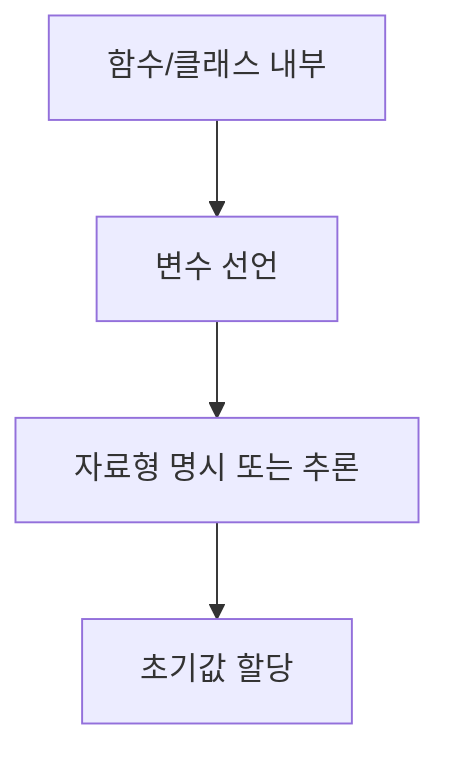

chapter2. 변수와 자료형 - 코틀린과 JS/TS 비교

---

# 개요

이 챕터에서는 코틀린의 변수 선언과 자료형을 Node.js, JavaScript, TypeScript와 비교하여 설명합니다. 타입 시스템, 변수 선언 방식, 파일 위치, 실무에서의 활용법을 초보자 관점에서 상세히 다룹니다.

---

## 1. 변수 선언 방식 비교

| 언어 | 변수 선언 키워드 | 예시 |
|------|------------------|------|
| Kotlin | var, val | var age = 25; val name = "홍길동" |
| JavaScript | var, let, const | let age = 25; |
| TypeScript | let, const (타입 명시) | let age: number = 25; |

---

## 2. 코틀린 변수 선언 예시

```kotlin
var age = 25 // 변경 가능한 변수 선언
val name = "홍길동" // 변경 불가능한 변수 선언
var isActive: Boolean = true // 타입 명시 가능
```

- `var`: 변경 가능한 변수
- `val`: 변경 불가능한 변수(자바의 final과 유사)
- 타입을 명시하지 않으면 타입 추론이 자동으로 적용됨

---

## 3. JavaScript/TypeScript 변수 선언 예시

### JavaScript
```javascript
let age = 25; // 타입을 명시하지 않아도 됨 (동적 타입)
let name = "홍길동";
let isActive = true;
```

### TypeScript
```typescript
let age: number = 25; // 타입을 명시 (정적 타입)
let name: string = "홍길동";
let isActive: boolean = true;
```

- JavaScript는 동적 타입, TypeScript와 코틀린은 정적 타입(타입 안정성 높음)

---

## 4. 코틀린의 자료형 종류

- 기본형: Int, Double, Boolean, Char 등
- 참조형: String, Array, 클래스 등

```kotlin
var score: Int = 90 // 정수형
var average: Double = 85.5 // 실수형
var grade: Char = 'A' // 문자형
var comment: String = "Good job!" // 문자열
```

---

## 5. 변수와 자료형의 파일 위치 및 패턴

- 코틀린 변수 선언은 함수 또는 클래스 내부에서 이루어집니다.
- 예시 파일 위치: `/src/main/kotlin/com/example/demo/chapters/VariableExample.kt`
- 본 문서 예제는 `/templates/Kotlin/chapters/chapter2. 변수와 자료형 - 코틀린과 JS/TS 비교.md`에 위치
- 이유: 챕터별로 주제를 분리하여 학습 흐름을 명확히 함

---

## 6. 실무에서 변수와 자료형 활용 팁

- 코틀린은 타입 추론이 강력하므로, 변수 선언 시 타입을 생략해도 무방
- 불변 변수(val) 사용을 권장하여 코드 안정성 향상
- 변수명은 의미 있게 작성, camelCase 권장

---

## 7. mermaid로 변수 선언 흐름 시각화



---

## 8. 참고

- 코틀린 공식 문서: https://kotlinlang.org/docs/home.html
- TypeScript 공식 문서: https://www.typescriptlang.org/docs/

---

## 9. 다음 챕터 예고

- 함수 선언과 람다: 실무 활용 중심

