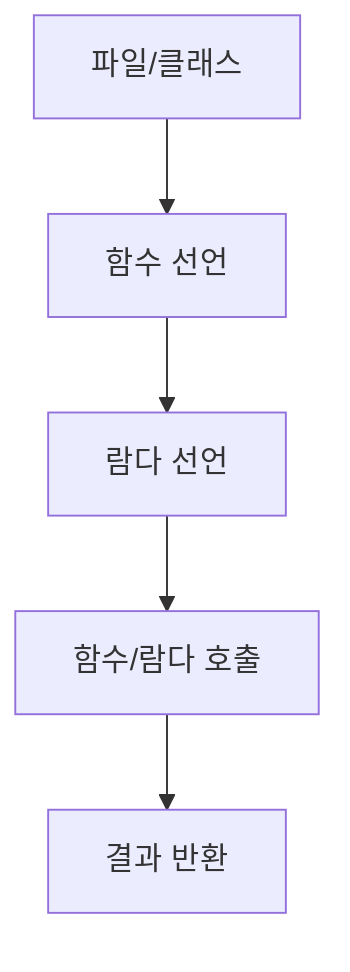

chapter3. 함수 선언과 람다 - 실무 활용 중심

---

# 개요

이 챕터에서는 코틀린의 함수 선언과 람다(익명 함수) 활용법을 Node.js, JavaScript, TypeScript와 비교하여 설명합니다. 초보자가 실무에서 자주 사용하는 패턴, 함수 구조, 파일 위치, 한 줄 한 줄 주석, 실무 팁을 상세히 다룹니다.

---

## 1. 함수 선언 방식 비교

| 언어 | 함수 선언 키워드 | 예시 |
|------|------------------|------|
| Kotlin | fun | fun add(a: Int, b: Int): Int {...} |
| JavaScript | function | function add(a, b) {...} |
| TypeScript | function (타입 명시) | function add(a: number, b: number): number {...} |

---

## 2. 코틀린 함수 선언 예시

```kotlin
fun add(a: Int, b: Int): Int { // fun: 함수 선언, Int: 매개변수 및 반환타입
    return a + b // 두 정수의 합을 반환
}
```

- 코틀린은 매개변수와 반환타입을 명확히 지정
- 함수는 파일 최상단 또는 클래스 내부에 선언 가능

---

## 3. 코틀린 람다(익명 함수) 예시

```kotlin
val sum = { a: Int, b: Int -> a + b } // 람다식: 두 정수의 합을 반환
println(sum(3, 5)) // 람다 호출, 결과: 8
```

- 람다는 변수에 할당하거나, 고차 함수에 전달 가능

---

## 4. JavaScript/TypeScript 함수 선언 예시

### JavaScript
```javascript
function add(a, b) { // 함수 선언, 타입 미지정
    return a + b;
}
```

### TypeScript
```typescript
function add(a: number, b: number): number { // 타입 명시
    return a + b;
}
```

---

## 5. 함수/람다의 파일 위치 및 패턴

- 코틀린 함수는 파일 최상단 또는 클래스 내부에 위치
- 예시 파일 위치: `/src/main/kotlin/com/example/demo/chapters/FunctionExample.kt`
- 본 문서 예제는 `/templates/Kotlin/chapters/chapter3. 함수 선언과 람다 - 실무 활용 중심.md`에 위치
- 이유: 챕터별로 주제를 분리하여 학습 흐름을 명확히 함

---

## 6. 실무에서 함수/람다 활용 팁

- 함수명은 동사+명사 형태로 작성, camelCase 권장
- 람다를 활용하면 코드가 간결해지고, 고차 함수(예: filter, map)에 유용
- 매개변수와 반환타입을 명확히 지정

---

## 7. mermaid로 함수 호출 흐름 시각화



---

## 8. 참고

- 코틀린 공식 문서: https://kotlinlang.org/docs/home.html
- TypeScript 공식 문서: https://www.typescriptlang.org/docs/

---

## 9. 다음 챕터 예고

- 클래스와 객체지향: MVC 패턴의 이해

