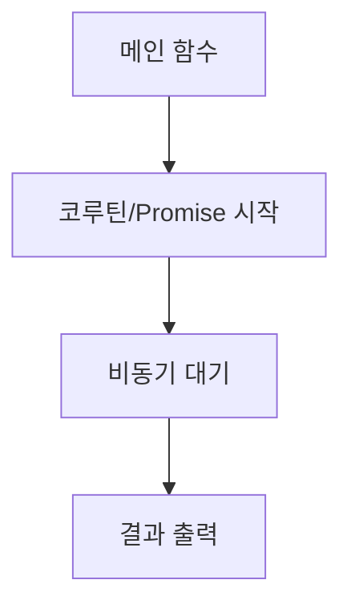

chapter6. 비동기 프로그래밍 - JS/TS와 코틀린의 차이

---

# 개요

이 챕터에서는 코틀린의 비동기 프로그래밍(코루틴)을 Node.js/JavaScript/TypeScript의 Promise/async와 비교하여 설명합니다. 초보자가 실무에서 비동기 처리를 어떻게 구현하는지, 각 언어별 차이와 장단점, 예시 코드, 한 줄 한 줄 주석, mermaid 시각화, 파일 위치 설명을 포함합니다.

---

## 1. 비동기 처리 방식 비교

| 언어 | 비동기 처리 방식 | 예시 |
|------|------------------|------|
| Kotlin | 코루틴 | launch { ... } |
| JavaScript | Promise/async | async function, await |
| TypeScript | Promise/async (타입 명시) | async function, await |

---

## 2. 코틀린 코루틴 예시

```kotlin
import kotlinx.coroutines.*

fun main() = runBlocking { // 코루틴 환경 생성
    launch { // 새로운 코루틴 시작
        delay(1000L) // 1초 대기 (비동기)
        println("코루틴 완료!") // 결과 출력
    }
    println("메인 함수 종료") // 메인 함수 실행
}
```

- runBlocking: 코루틴 환경을 생성
- launch: 새로운 코루틴(비동기 작업) 시작
- delay: 비동기 대기(스레드 블로킹 없음)
- println: 결과 출력

---

## 3. JavaScript/TypeScript 비동기 예시

### JavaScript
```javascript
async function runAsync() {
    await new Promise(resolve => setTimeout(resolve, 1000)); // 1초 대기
    console.log("Promise 완료!"); // 결과 출력
}
runAsync();
console.log("메인 함수 종료");
```

### TypeScript
```typescript
async function runAsync(): Promise<void> {
    await new Promise(resolve => setTimeout(resolve, 1000)); // 1초 대기
    console.log("Promise 완료!"); // 결과 출력
}
runAsync();
console.log("메인 함수 종료");
```

---

## 4. 파일 위치 및 패턴 설명

- 코틀린 비동기 코드는 일반적으로 서비스 계층 또는 별도 유틸 클래스에 위치
- 예시 파일 위치: `/src/main/kotlin/com/example/demo/service/AsyncService.kt`
- 본 문서 예제는 `/templates/Kotlin/chapters/chapter6. 비동기 프로그래밍 - JS/TS와 코틀린의 차이.md`에 위치
- 이유: 비동기 로직을 분리하여 유지보수와 테스트에 용이함

---

## 5. 실무에서 비동기 프로그래밍 활용 팁

- 코루틴은 경량 스레드로, 대규모 동시성 처리에 적합
- launch, async, withContext 등 다양한 코루틴 빌더 활용
- 예외 처리와 취소(Cancellation) 기능을 적극적으로 사용
- JS/TS의 Promise/async와 개념적으로 유사하지만, 코루틴은 더 효율적임

---

## 6. mermaid로 비동기 흐름 시각화



---

## 7. 참고

- 코틀린 코루틴 공식 문서: https://kotlinlang.org/docs/coroutines-overview.html
- JavaScript Promise 공식 문서: https://developer.mozilla.org/ko/docs/Web/JavaScript/Reference/Global_Objects/Promise

---

## 8. 다음 챕터 예고

- 파일 구조와 패키지 관리

